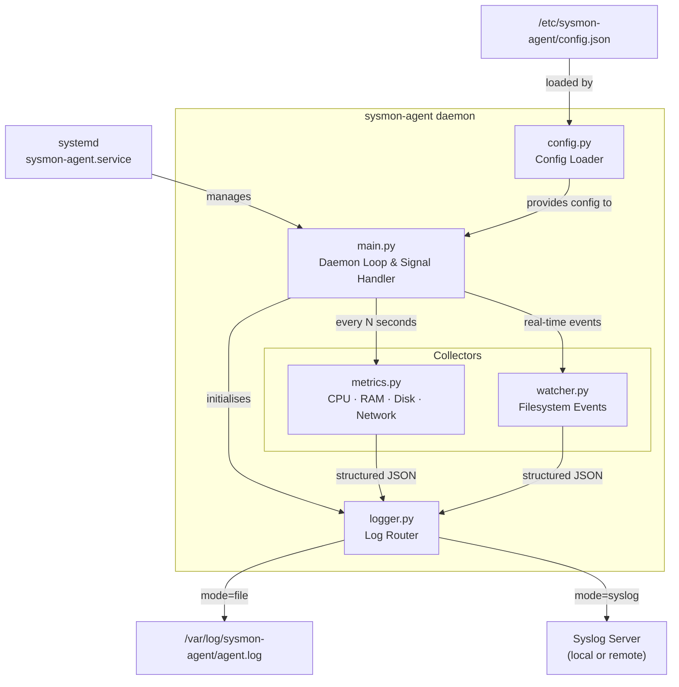

# Lightweight System Monitoring Agent

> A production-ready Python daemon for Linux (Ubuntu/Debian) that collects system metrics, monitors filesystem changes in real-time, and routes structured logs to local files or remote Syslog servers.

---

## System Architecture



---

## Prerequisites

| Requirement | Version |
|---|---|
| Operating System | Ubuntu 20.04+ / Debian 11+ |
| Python | 3.10+ |
| `python3-psutil` | ≥ 5.9.0 |
| `python3-watchdog` | ≥ 3.0.0 |
| `dpkg-deb` | (for building the `.deb` package) |

---

## Project Structure

```
sysmon-agent/
├── agent/
│   ├── __init__.py
│   ├── main.py                 # Daemon entry point
│   ├── collectors/
│   │   ├── __init__.py
│   │   ├── metrics.py          # CPU, RAM, Disk, Network collector
│   │   └── watcher.py          # Filesystem event monitor
│   └── utils/
│       ├── __init__.py
│       ├── config.py           # Config loader & validator
│       ├── logger.py           # Syslog / file log router
│       ├── dashboard.py        # HTTP dashboard server
│       └── dashboard.html      # Dashboard UI template
├── config/
│   └── config.json             # Default configuration
├── deployment/
│   └── sysmon-agent.service    # systemd unit file
├── debian/
│   └── build.sh                # .deb packaging script
├── docs/
│   └── system_design.md        # System design document
├── tests/
│   ├── __init__.py
│   ├── test_config.py          # Config loader tests
│   ├── test_logger.py          # Logger tests
│   ├── test_metrics.py         # Metrics collector tests
│   ├── test_watcher.py         # Filesystem watcher tests
│   └── test_dashboard.py       # Dashboard server tests
├── demo.sh                     # Interactive demo script
├── requirements.txt
└── README.md
```

---

## Configuration Reference

The configuration file is located at `/etc/sysmon-agent/config.json` after installation, or `config/config.json` during development.

```json
{
    "interval": 30,
    "disk_mount_points": ["/"],
    "monitored_paths": ["/etc", "/var/log"],
    "dashboard": {
        "enabled": true,
        "port": 8080,
        "bind_address": "0.0.0.0"
    },
    "logging": {
        "mode": "file",
        "log_file_path": "/var/log/sysmon-agent/agent.log",
        "max_bytes": 10485760,
        "backup_count": 5,
        "syslog_address": "127.0.0.1",
        "syslog_port": 514,
        "syslog_protocol": "udp"
    }
}
```

| Field | Type | Default | Description |
|---|---|---|---|
| `interval` | `int` | `30` | Seconds between metrics collection cycles |
| `disk_mount_points` | `list[str]` | `["/"]` | Mount points to monitor (avoids virtual FS) |
| `monitored_paths` | `list[str]` | `[]` | Files/directories to watch for changes |
| `logging.mode` | `str` | `"file"` | `"file"` for local log files, `"syslog"` for syslog |
| `logging.log_file_path` | `str` | see above | Path for local log file (mode=file) |
| `logging.max_bytes` | `int` | `10485760` | Max log file size before rotation (10 MB) |
| `logging.backup_count` | `int` | `5` | Number of rotated log files to keep |
| `logging.syslog_address` | `str` | `"127.0.0.1"` | Syslog server address or `/dev/log` |
| `logging.syslog_port` | `int` | `514` | Syslog server port (mode=syslog) |
| `logging.syslog_protocol` | `str` | `"udp"` | `"udp"` or `"tcp"` for remote syslog |
| `dashboard.enabled` | `bool` | `true` | Enable/disable the web dashboard |
| `dashboard.port` | `int` | `8080` | HTTP port for the dashboard server |
| `dashboard.bind_address` | `str` | `"0.0.0.0"` | Bind address for the dashboard server |

---

## Build Instructions

### Install Dependencies

```bash
sudo apt update
sudo apt install python3 python3-pip dpkg-dev
pip3 install -r requirements.txt
```

### Build the `.deb` Package

```bash
chmod +x debian/build.sh
./debian/build.sh 1.0.0
```

The package will be output to `dist/sysmon-agent_1.0.0_all.deb`.

---

## Deployment & Usage Guide

### Install the Package

```bash
sudo dpkg -i dist/sysmon-agent_1.0.0_all.deb
```

If dependencies are missing, resolve them with:

```bash
sudo apt install -f
```

The `postinst` script will automatically:
1. Reload the systemd daemon
2. Enable the service for boot
3. Start the service immediately

### Modify Configuration

```bash
sudo nano /etc/sysmon-agent/config.json
sudo systemctl restart sysmon-agent
```

### Service Management

```bash
# Check service status
sudo systemctl status sysmon-agent

# Start / Stop / Restart
sudo systemctl start sysmon-agent
sudo systemctl stop sysmon-agent
sudo systemctl restart sysmon-agent

# Enable / Disable auto-start on boot
sudo systemctl enable sysmon-agent
sudo systemctl disable sysmon-agent
```

### View Logs

```bash
# Live follow via systemd journal
sudo journalctl -u sysmon-agent -f

# View last 100 lines
sudo journalctl -u sysmon-agent -n 100

# View logs since last boot
sudo journalctl -u sysmon-agent -b

# View local log file (if mode=file)
sudo tail -f /var/log/sysmon-agent/agent.log
```

### Uninstall

```bash
# Remove package (keep config)
sudo dpkg -r sysmon-agent

# Remove package and purge config/logs
sudo dpkg -P sysmon-agent
```

---

## Metrics Output Example

Each collection cycle produces a JSON snapshot:

```json
{
    "timestamp": "2026-06-17T02:30:00.000000+00:00",
    "cpu": {
        "cpu_percent": 12.5,
        "cpu_count_logical": 4,
        "cpu_count_physical": 2
    },
    "memory": {
        "total_bytes": 8368349184,
        "available_bytes": 5234491392,
        "used_bytes": 2847932416,
        "used_percent": 37.4
    },
    "disk": {
        "/": {
            "total_bytes": 52710469632,
            "used_bytes": 18340904960,
            "free_bytes": 31647621120,
            "used_percent": 36.7
        }
    },
    "network": {
        "cumulative": {
            "bytes_sent": 1048576000,
            "bytes_recv": 5242880000,
            "packets_sent": 750000,
            "packets_recv": 3200000,
            "errin": 0,
            "errout": 0,
            "dropin": 0,
            "dropout": 0
        },
        "delta": {
            "bytes_sent": 32768,
            "bytes_recv": 131072,
            "bytes_sent_per_sec": 1092.27,
            "bytes_recv_per_sec": 4369.07,
            "elapsed_seconds": 30.0
        }
    }
}
```

---

## Web Dashboard

The agent includes a built-in lightweight web dashboard for real-time monitoring. When enabled, it serves an HTML interface that displays:

- **CPU / RAM / Disk / Network** metric cards with live values and progress bars
- **Historical chart** of CPU & RAM usage over time (Chart.js line chart)
- **Disk usage** doughnut chart
- **Filesystem events** table with colour-coded event types

### Accessing the Dashboard

```bash
# Dashboard is enabled by default on port 8080
# Open in your browser:
http://<server-ip>:8080
```

### Dashboard API Endpoints

| Endpoint | Method | Description |
|---|---|---|
| `/` | GET | Serve the dashboard HTML page |
| `/api/logs` | GET | Return the last 200 parsed JSON log entries |
| `/api/config` | GET | Return the current agent configuration |

### Disabling the Dashboard

Set `dashboard.enabled` to `false` in the configuration file:

```json
{
    "dashboard": {
        "enabled": false
    }
}
```

---

## Documentation

- **System Design Document**: See [`docs/system_design.md`](docs/system_design.md) for detailed architecture, sequence diagrams, data schemas, design decisions, and trade-off analysis.

---

## Quick Demo (without .deb)

Run the interactive demo directly from the source tree on any Linux machine:

```bash
# Install dependencies
pip3 install psutil watchdog

# Run the demo
chmod +x demo.sh
sudo ./demo.sh
```

The demo will:
1. Create a temporary config and watched directory
2. Start the agent in the background
3. Show a real metrics collection snapshot (CPU, RAM, Disk, Network)
4. Create, modify, and delete files to trigger filesystem events
5. Display all captured events in formatted output
6. Clean up and stop the agent

---

## License

MIT
