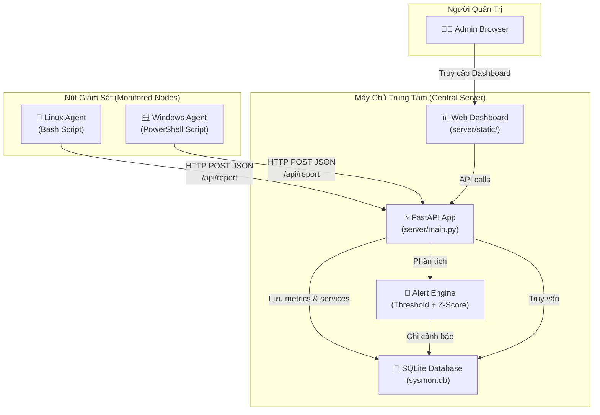
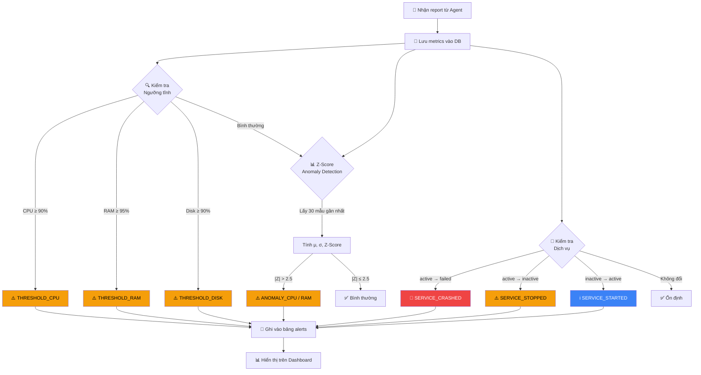
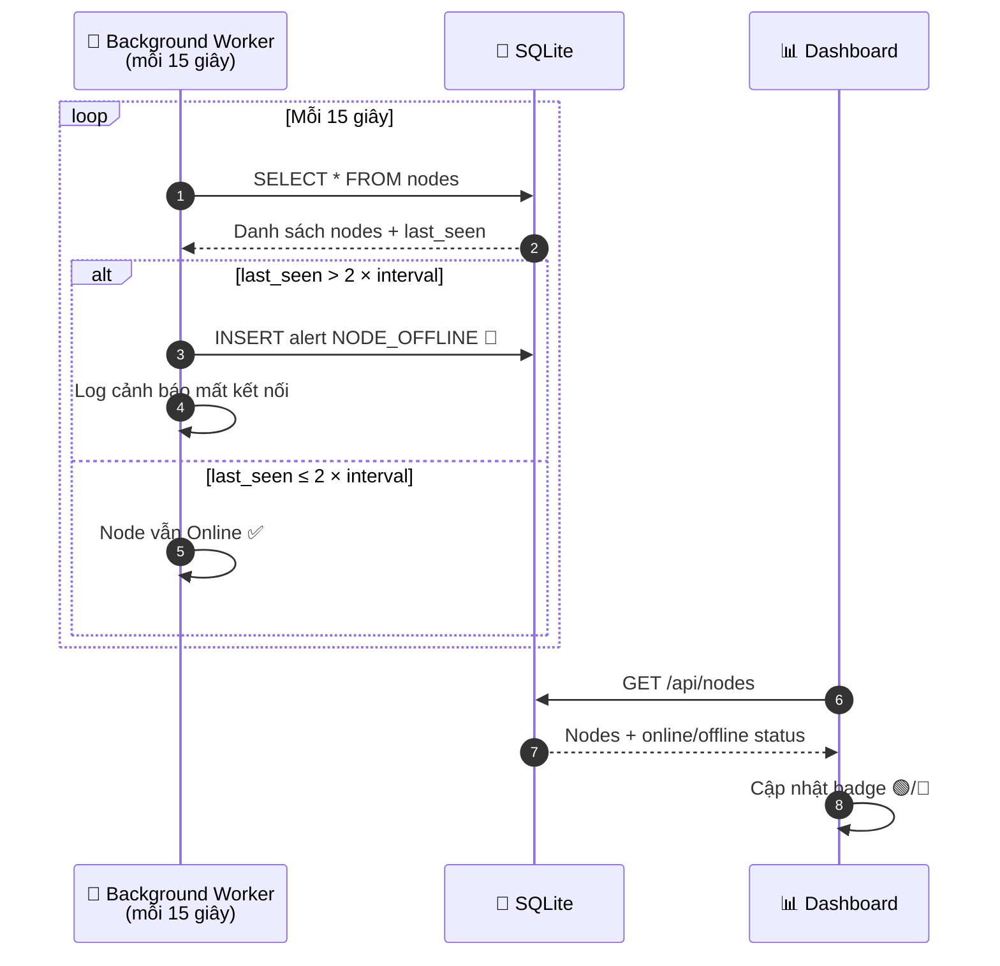
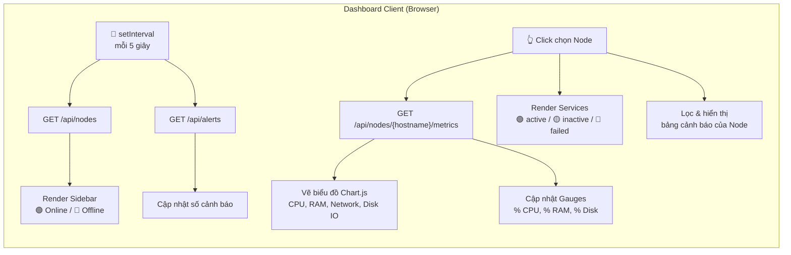

# Centralized System Monitoring System (Sysmon Central)

Hệ thống giám sát tài nguyên và ứng dụng dịch vụ tập trung đa máy ảo, sử dụng **Native Agent (không phụ thuộc)** trên các nút giám sát và **Central Manager Server** (FastAPI + SQLite) để lưu trữ và hiển thị.

---

## 1. Kiến trúc hệ thống



---

## 2. Workflow — Luồng hoạt động của hệ thống

### 2.1 Luồng thu thập dữ liệu (Data Collection Flow)

```mermaid
sequenceDiagram
    autonumber
    participant Agent as 🖥️ Native Agent<br/>(Bash / PowerShell)
    participant Proc as 📁 /proc & OS Tools
    participant Server as ⚡ Central Server
    participant DB as 💾 SQLite
    participant Alert as 🔔 Alert Engine

    rect rgb(20, 30, 50)
    Note over Agent,Proc: Bước 1 — Thu thập metric từ OS
    Agent->>Proc: Đọc /proc/stat (CPU ticks)
    Agent->>Proc: Đọc /proc/meminfo (RAM)
    Agent->>Proc: Đọc /proc/net/dev (Network)
    Agent->>Proc: Đọc /proc/diskstats (Disk IO)
    Agent->>Proc: Chạy df -B1 (Disk capacity)
    Agent->>Proc: Chạy systemctl / Get-Service
    Proc-->>Agent: Dữ liệu thô
    end

    rect rgb(20, 40, 30)
    Note over Agent,Server: Bước 2 — Gửi JSON về Server
    Agent->>Server: POST /api/report (JSON payload)
    Server-->>Agent: {"status": "ok"}
    end

    rect rgb(40, 20, 30)
    Note over Server,Alert: Bước 3 — Xử lý & Phân tích
    Server->>DB: Đăng ký / Cập nhật Node
    Server->>DB: Lưu metrics & services
    Server->>Alert: Kiểm tra ngưỡng tĩnh
    Server->>Alert: Tính Z-Score anomaly
    Server->>Alert: Kiểm tra thay đổi dịch vụ
    Alert->>DB: Ghi cảnh báo (nếu có)
    end

    Note over Agent: ⏱️ sleep(interval)
    Note over Agent: 🔁 Lặp lại chu kỳ
```



### 2.2 Luồng phát hiện bất thường (Alert Detection Flow)



### 2.3 Luồng giám sát trạng thái Node (Offline Detection Flow)



### 2.4 Luồng hiển thị Dashboard (UI Rendering Flow)



---

## 3. Cấu trúc dự án

```
sysmon-central/
├── agents/                         # Các agent native (zero-dependency)
│   ├── linux/
│   │   ├── agent.sh                # Linux Bash Agent
│   │   └── config.json             # Cấu hình agent
│   └── windows/
│       ├── agent.ps1               # Windows PowerShell Agent
│       └── config.json             # Cấu hình agent
├── server/                         # Máy chủ quản trị tập trung
│   ├── __init__.py                 # Package marker
│   ├── main.py                     # FastAPI Server + Alert Engine
│   ├── database.py                 # SQLite database layer
│   ├── config.py                   # Cấu hình ngưỡng & giải thuật
│   ├── server_config.json          # File config chỉnh sửa được
│   └── static/
│       ├── index.html              # Dashboard UI (responsive)
│       └── app.js                  # Dashboard logic + Chart.js
├── tests/
│   └── test_server_api.py          # 40 test cases (API, alerts, anomaly, DB)
├── debian/                         # Đóng gói .deb cho agent Linux
│   ├── DEBIAN/
│   │   ├── control                 # Package metadata
│   │   ├── postinst                # Post-install script
│   │   └── prerm                   # Pre-removal script
│   └── build_deb.py                # Script build file .deb (Portable Python)
├── deployment/
│   └── sysmon-agent.service        # Systemd service unit
├── benchmark_agent.sh              # Script đo lường hiệu năng agent
├── requirements.txt                # Server-only deps (FastAPI, Uvicorn)
└── README.md
```

---

## 4. Hướng dẫn thiết lập & Chạy máy chủ (Central Server)

### 4.1 Cài đặt các thư viện cần thiết:
```bash
pip install -r requirements.txt
```

### 4.2 Khởi chạy Máy chủ:
```bash
python -m server.main
```
Mặc định máy chủ sẽ khởi chạy tại cổng `http://localhost:8000`. Bạn có thể truy cập trực tiếp bằng trình duyệt để xem giao diện Dashboard.

---

## 5. Hướng dẫn deploy Agent trên các máy ảo (Monitored Nodes)

Các agent được tối ưu hóa để chạy **không phụ thuộc** vào Python hay thư viện ngoài, sử dụng chính các công cụ có sẵn của hệ điều hành.

### 5.1 Cài đặt nhanh bằng file .deb (Ubuntu/Debian)
```bash
# Build file .deb (Hỗ trợ chạy trên cả Windows và Linux thông qua Python)
python debian/build_deb.py

# Cài đặt trên máy ảo đích
sudo dpkg -i sysmon-agent_2.0.0_all.deb

# Sửa config chỉ đến Central Server
sudo nano /opt/sysmon-agent/config.json

# Khởi động agent
sudo systemctl start sysmon-agent
```

### 5.2 Cài đặt thủ công trên máy ảo Linux
1. Copy thư mục `agents/linux/` sang máy ảo đích.
2. Cấu hình file `config.json` chỉ định địa chỉ của Central Server:
   ```json
   {
       "server_url": "http://<IP_SERVER>:8000/api/report",
       "interval": 10,
       "disk_mount_points": ["/"],
       "services": ["nginx", "mysql", "sshd"]
   }
   ```
3. Cấp quyền thực thi và chạy agent:
   ```bash
   chmod +x agent.sh
   ./agent.sh
   ```

### 5.3 Cài đặt trên máy ảo Windows
1. Copy thư mục `agents/windows/` sang máy ảo đích.
2. Cấu hình file `config.json` tương tự như trên.
3. Mở PowerShell với quyền Administrator và chạy script:
   ```powershell
   Set-ExecutionPolicy Bypass -Scope Process -Force
   .\agent.ps1
   ```

---

## 6. Các tính năng nổi bật & Thuật toán giám sát

| Tính năng | Mô tả |
|---|---|
| **Lightweight Native Agents** | Chỉ dùng Bash (Linux) và PowerShell (Windows), file ~10 KB, không cần Python/pip |
| **Rich Metrics** | CPU (load avg 1/5/15m), RAM (total/used/available/buffers/cached/swap), Disk IO (read/write MB/s), Network (Rx/Tx per interface) |
| **Service Monitoring** | Giám sát trạng thái dịch vụ qua `systemctl` (Linux) / `Get-Service` (Windows) |
| **Static Threshold Alerts** | Cảnh báo khi CPU ≥ 90%, RAM ≥ 95%, Disk ≥ 90% (có thể tùy chỉnh) |
| **Z-Score Anomaly Detection** | Phát hiện biến động bất thường dựa trên 30 mẫu gần nhất (Z > 2.5) |
| **Offline Node Detection** | Background worker phát hiện node mất kết nối sau 2× interval |
| **Multi-node Dashboard** | Giao diện tập trung hiển thị tất cả máy ảo, biểu đồ Chart.js thời gian thực |
| **Đóng gói .deb** | Cài đặt 1 lệnh `dpkg -i`, gỡ 1 lệnh `dpkg -r` |

---

## 7. API Endpoints

| Method | Endpoint | Mô tả |
|---|---|---|
| `POST` | `/api/report` | Agent gửi dữ liệu metrics (JSON) |
| `GET` | `/api/nodes` | Danh sách tất cả nodes + online/offline |
| `GET` | `/api/nodes/{hostname}/metrics` | Lịch sử metrics của 1 node |
| `GET` | `/api/nodes/{hostname}/services` | Trạng thái dịch vụ của 1 node |
| `DELETE` | `/api/nodes/{hostname}` | Xóa node và toàn bộ dữ liệu |
| `GET` | `/api/alerts` | Danh sách cảnh báo gần đây |
| `GET` | `/` | Web Dashboard |

---

## 8. Chạy kiểm thử

```bash
python -m pytest tests/ -v
```
Kết quả: **40 test cases passed** — bao phủ API endpoints, threshold alerts, Z-Score anomaly, service monitoring, database layer, và config loading.
