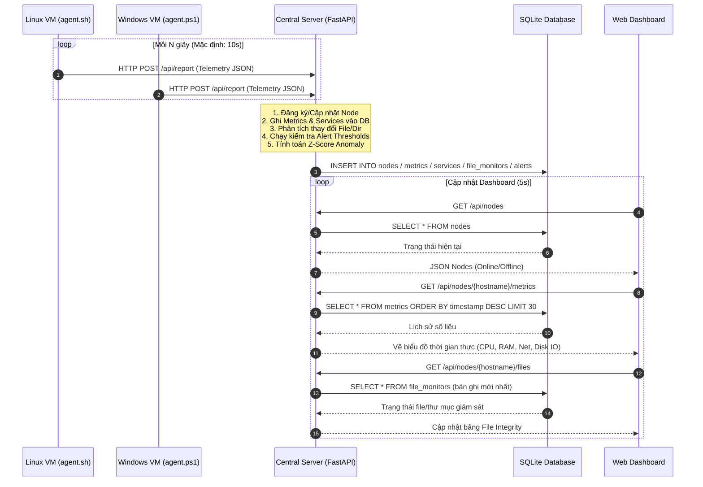
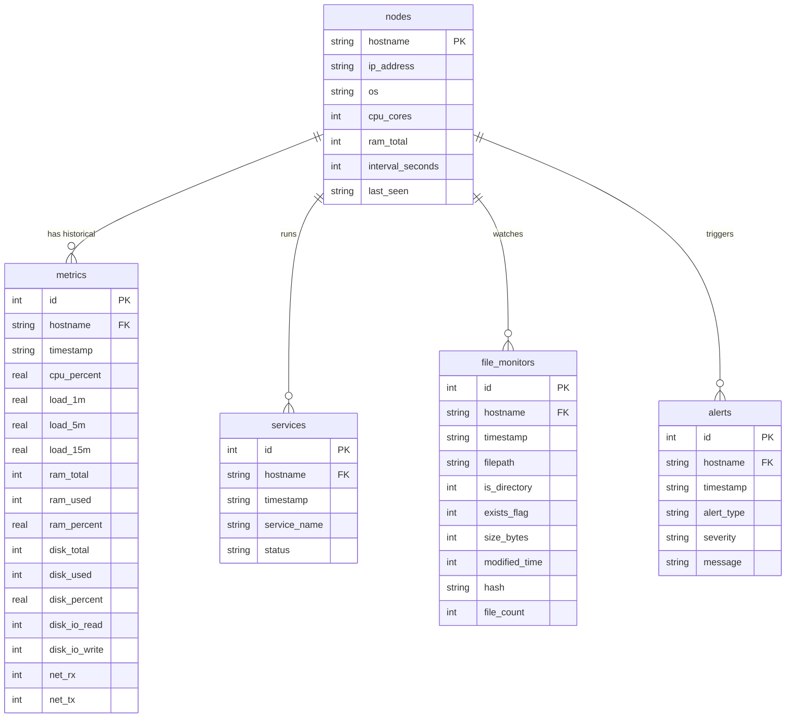

# Tài liệu Thiết kế Hệ thống: Centralized Monitoring System (Sysmon Central)

Tài liệu này mô tả chi tiết thiết kế kiến trúc, luồng dữ liệu, cấu trúc cơ sở dữ liệu, thuật toán giám sát và các giải pháp đóng gói của hệ thống **Sysmon Central**. Tài liệu được biên soạn nhằm phục vụ cho báo cáo kỹ thuật và bảo vệ dự án.

---

## 1. Kiến trúc Tổng quan (System Architecture)

Hệ thống được thiết kế theo mô hình **Client-Server (Agent-Collector) tập trung**, hoạt động theo cơ chế **Push-based** nhằm tối ưu hóa khả năng truyền tải dữ liệu qua Firewall/NAT.

```
                           +----------------------------+
                           |       Central Server       |
                           |   (FastAPI + SQLite DB)    |
                           +--------------+-------------+
                                          ^
                                          | HTTP POST JSON
                     +--------------------+--------------------+
                     |                                         |
        +------------+------------+               +------------+------------+
        |       Linux Agent       |               |      Windows Agent      |
        |   (Native Bash Script)  |               |  (Native PowerShell)    |
        |  - Giám sát CPU/RAM     |               |  - Giám sát CPU/RAM     |
        |  - Giám sát Disk/Net    |               |  - Giám sát Disk/Net    |
        |  - Trạng thái Service   |               |  - Trạng thái Service   |
        |  - Giám sát File/Dir    |               |  - Giám sát File/Dir    |
        +-------------------------+               +-------------------------+
```

### 1.1. Các thành phần chính của hệ thống
1. **Monitored Nodes (Client Agents):** Các script native siêu nhẹ (**Bash** trên Linux, **PowerShell** trên Windows) chạy tuần hoàn dưới dạng background service. Các agent thu thập telemetry thô trực tiếp từ hệ điều hành và đẩy qua REST API về Collector.
2. **Central Collector Server:** Được xây dựng bằng **FastAPI** (Python), chịu trách nhiệm:
   - Tiếp nhận dữ liệu cấu trúc từ các agent thông qua endpoint `/api/report`.
   - Ghi nhận lịch sử tài nguyên và trạng thái vào cơ sở dữ liệu **SQLite**.
   - Phân tích và phát hiện bất thường động (ngưỡng tĩnh + thuật toán Z-Score + thay đổi file).
   - Cung cấp REST API cho giao diện người dùng.
3. **Web Dashboard:** Giao diện điều khiển tập trung sử dụng HTML5, Vanilla CSS (kết hợp Glassmorphism) và thư viện **Chart.js** hiển thị dữ liệu thời gian thực của nhiều máy ảo.

### 1.2. Luồng dữ liệu tuần hoàn (Data Flow)



---

## 2. Thiết kế Cơ sở dữ liệu (Database Schema)

Hệ thống sử dụng cơ sở dữ liệu **SQLite** gọn nhẹ được quản lý thông qua [database.py](file:///e:/Prj%20System/server/database.py). Cơ sở dữ liệu bao gồm 5 bảng chính được thiết kế tối ưu hóa quan hệ:



### 2.1 Bảng `nodes` (Danh sách thiết bị giám sát)
Lưu trữ thông tin phần cứng và trạng thái kết nối mới nhất của mỗi node.
* **`hostname` (TEXT, PK):** Định danh duy nhất cho máy ảo/máy vật lý.
* **`ip_address` (TEXT):** Địa chỉ IP gần nhất.
* **`os` (TEXT):** Hệ điều hành (`Linux` hoặc `Windows`).
* **`cpu_cores` (INTEGER):** Số lõi CPU logic của máy ảo.
* **`ram_total` (INTEGER):** Tổng dung lượng RAM vật lý (Bytes).
* **`interval_seconds` (INTEGER):** Tần suất gửi báo cáo của Agent (mặc định 10s).
* **`last_seen` (TEXT):** Thời gian nhận gói tin cuối cùng (ISO 8601 UTC).

### 2.2 Bảng `metrics` (Nhật ký tài nguyên phần cứng)
* **`id` (INTEGER, PK, AUTOINCREMENT):** Khóa chính tăng tự động.
* **`hostname` (TEXT, FK):** Liên kết với bảng `nodes`.
* **`timestamp` (TEXT):** Thời điểm ghi nhận metric.
* **`cpu_percent` (REAL):** Tốc độ sử dụng CPU hiện tại (%).
* **`load_1m`, `load_5m`, `load_15m` (REAL):** Chỉ số tải trung bình (chỉ trên Linux, Windows giả lập).
* **`ram_total`, `ram_used` (INTEGER), `ram_percent` (REAL):** Dung lượng RAM.
* **`disk_total`, `disk_used` (INTEGER), `disk_percent` (REAL):** Dung lượng phân vùng ổ đĩa chính (`/` hoặc `C:`).
* **`disk_io_read`, `disk_io_write` (INTEGER):** Tổng số bytes đọc/ghi tích lũy.
* **`net_rx`, `net_tx` (INTEGER):** Tổng số bytes nhận/gửi tích lũy trên card mạng.

### 2.3 Bảng `services` (Trạng thái dịch vụ)
* **`hostname` (TEXT, FK), `service_name` (TEXT):** Cặp giá trị duy nhất (`UNIQUE`) để cập nhật đè trạng thái mới nhất của dịch vụ.
* **`status` (TEXT):** Trạng thái dịch vụ (`active`, `inactive`, `failed`).

### 2.4 Bảng `file_monitors` (Lịch sử trạng thái File & Thư mục)
Lưu trữ lịch sử toàn vẹn của tệp cấu hình và thư mục giám sát.
* **`filepath` (TEXT):** Đường dẫn tuyệt đối đến file/thư mục được chỉ định giám sát.
* **`is_directory` (INTEGER):** Cờ phân biệt (1: Thư mục, 0: Tệp tin).
* **`exists_flag` (INTEGER):** Trạng thái tồn tại của tệp (1: Tồn tại, 0: Đã bị xóa).
* **`size_bytes` (INTEGER):** Kích thước tệp tin hoặc tổng dung lượng thư mục (Bytes).
* **`modified_time` (INTEGER):** Unix timestamp sửa đổi cuối cùng của file/thư mục (`mtime`).
* **`hash` (TEXT):** Mã băm **MD5** của nội dung tệp tin (rỗng đối với thư mục).
* **`file_count` (INTEGER):** Số lượng tệp con bên trong (chỉ áp dụng đối với thư mục).

### 2.5 Bảng `alerts` (Nhật ký Cảnh báo & Bất thường)
* **`alert_type` (TEXT):** Phân loại lỗi (`THRESHOLD_CPU`, `NODE_OFFLINE`, `FILE_DELETED`, `FILE_MODIFIED`, v.v.).
* **`severity` (TEXT):** Mức độ nghiêm trọng (`INFO`, `WARNING`, `CRITICAL`).
* **`message` (TEXT):** Nội dung chi tiết sự kiện cảnh báo.

---

## 3. Các cơ chế giám sát thông minh (Monitoring Intelligence)

Hệ thống kết hợp ba phương pháp phát hiện cảnh báo để đảm bảo tính kịp thời và tránh cảnh báo nhiễu:

### 3.1. Giám sát độ toàn vẹn Tệp tin & Thư mục (File Integrity Monitoring - FIM)
Giải thuật giám sát tệp tin hoạt động theo nguyên tắc so sánh trạng thái trước-sau:
1. Khi Server nhận payload chứa mảng `file_monitoring`, nó sẽ truy vấn trạng thái gần nhất trong DB qua hàm `get_last_file_state()`.
2. Thực hiện so sánh:
   - **Xác định file bị xóa:** Nếu bản ghi trước `exists_flag = 1` nhưng gói tin hiện tại gửi `exists = false` $\rightarrow$ Phát cảnh báo **`FILE_DELETED`** (Mức **CRITICAL**).
   - **Xác định nội dung bị chỉnh sửa (đối với tệp tin):** So sánh mã băm MD5 trước và sau. Nếu `prev_hash != current_hash` $\rightarrow$ Phát cảnh báo **`FILE_MODIFIED`** (Mức **WARNING**). Đây là tính năng cốt lõi giúp phát hiện hành vi tấn công mạng chèn Webshell hoặc sửa tệp cấu hình hệ thống trái phép.
   - **Xác định dung lượng biến động lớn:** Nếu kích thước biến động trên 50% so với trước ($\Delta S > 0.5 \times S_{prev}$) $\rightarrow$ Phát cảnh báo **`FILE_SIZE_CHANGED`** (Mức **INFO**).

### 3.2. Phát hiện bất thường động (Z-Score Anomaly Detection)
Để phát hiện các lỗi rò rỉ bộ nhớ (memory leak) hoặc tấn công từ chối dịch vụ làm tăng băng thông từ từ, hệ thống áp dụng công thức thống kê Z-Score trên cửa sổ trượt 30 mẫu lịch sử:

$$Z = \frac{x_i - \mu}{\sigma}$$

*Trong đó:*
- $x_i$: Giá trị đo lường hiện tại (ví dụ: RAM %).
- $\mu$: Giá trị trung bình của chuỗi lịch sử gần nhất.
- $\sigma$: Độ lệch chuẩn của chuỗi lịch sử gần nhất:
$$\sigma = \sqrt{\frac{1}{N}\sum_{j=1}^N (x_j - \mu)^2}$$

Nếu trị tuyệt đối $|Z| > \text{z\_threshold}$ (mặc định 2.5), Server sẽ phát ra cảnh báo bất thường **`ANOMALY_RAM`** hoặc **`ANOMALY_CPU`**. Cơ chế này giúp phát hiện hành vi bất thường của tài nguyên mà không cần chạm ngưỡng tĩnh 90% hay 95%.

### 3.3. Giám sát mất kết nối máy chủ (Offline Detector)
Một luồng background worker trên Server định kỳ quét bảng `nodes` mỗi 15 giây.
Nếu thời gian hiện tại vượt quá $2 \times \text{interval\_seconds}$ kể từ `last_seen` của node đó, Server sẽ chuyển trạng thái của node sang **Offline** trên Dashboard và ghi một cảnh báo **`NODE_OFFLINE`** (Mức **CRITICAL**).

---

## 4. Cơ chế Logging & Giao tiếp tích hợp

### 4.1. Thiết kế Giao tiếp
Dữ liệu gửi từ Agent lên Server sử dụng định dạng JSON thuần qua HTTP POST. Cấu trúc payload định dạng như sau:

```json
{
  "timestamp": "2026-07-04T08:30:00Z",
  "os": "Linux",
  "hostname": "viettel-vm-web",
  "cpu": { "cpu_percent": 12.5, "cpu_count_logical": 4, "load_1m": 0.5 },
  "memory": { "total_bytes": 8589934592, "used_percent": 45.2 },
  "disk": { "/": { "total_bytes": 53687091200, "used_percent": 33.1 } },
  "disk_io": { "device": "sda", "read_bytes": 204800, "write_bytes": 409600 },
  "network": { "eth0": { "rx_bytes": 1048576, "tx_bytes": 512000 } },
  "services": { "sshd": "active", "nginx": "active" },
  "file_monitoring": [
    {
      "path": "/etc/passwd",
      "is_directory": false,
      "exists": true,
      "size_bytes": 1280,
      "modified_time": 1720000000,
      "hash": "d41d8cd98f00b204e9800998ecf8427e",
      "file_count": 0
    }
  ]
}
```

### 4.2. Cơ chế Logging cục bộ & Đẩy Syslog
Để đảm bảo ghi chép sự kiện hoạt động của Agent đáp ứng tiêu chuẩn SOC doanh nghiệp:
* **Linux Agent:** Hàm `log_message()` ghi log đồng thời ra `stdout`, ghi đè vào file chỉ định (mặc định `/var/log/sysmon-agent.log`) và gọi tiện ích `logger` đẩy trực tiếp sang syslog cục bộ của Linux với định danh tag `sysmon-agent`.
* **Windows Agent:** Hàm `Write-Log` xuất log ra Console, ghi file log cục bộ và sử dụng cmdlet `Write-EventLog` để ghi trực tiếp sự kiện vào **Windows Event Log** (Application log source: `sysmon-agent`).

---

## 5. Giải pháp Đóng gói & Triển khai doanh nghiệp

Để cài đặt diện rộng bằng các công cụ Automation (Ansible, Puppet, Chef), hệ thống hỗ trợ 2 cơ chế đóng gói native:

### 5.1. Đóng gói Debian (`.deb`)
Sử dụng script [build_deb.py](file:///e:/Prj%20System/debian/build_deb.py) viết bằng Python thuần. Script này đóng gói tệp tin mà không yêu cầu binary `dpkg-deb`, tạo ra gói cài đặt bao gồm:
* Thư mục cài đặt: `/opt/sysmon-agent/` (chứa `agent.sh` và `config.json`).
* File service: `/lib/systemd/system/sysmon-agent.service`.
* Script hậu cài đặt `postinst` tự động chạy lệnh `systemctl enable --now sysmon-agent`.

### 5.2. Đóng gói RedHat RPM (`.rpm`)
Sử dụng file đặc tả [sysmon-agent.spec](file:///e:/Prj%20System/rpm/sysmon-agent.spec) và script [build_rpm.py](file:///e:/Prj%20System/rpm/build_rpm.py).
* Cấu hình đánh dấu `%config(noreplace)` đối với file `/opt/sysmon-agent/config.json` để bảo vệ cấu hình URL kết nối của người dùng không bị đè mất khi thực hiện nâng cấp phiên bản Agent (Upgrade).
* Tự động đăng ký daemon-reload và nạp lại dịch vụ systemd trong các lệnh `%post`, `%preun`, và `%postun`.

---

## 6. Kiểm thử & Đánh giá Hiệu năng

### 6.1. Kiểm thử tự động (Unit/Integration Tests)
Hệ thống tích hợp bộ kiểm thử toàn diện gồm **50 test cases** viết trên framework `pytest` (bao phủ 100% các API, Database Layer, kiểm tra Threshold, Z-Score, Service Crash và File Integrity Alerts).

### 6.2. Kết quả đo lường hiệu năng thực tế (Benchmark)
Chạy thử nghiệm đo lường hiệu năng của Bash Agent trên Linux:
* **RAM footprint:** ~1.5 MB RAM (Nhẹ hơn Prometheus Node Exporter viết bằng Go và nhẹ hơn 20 lần so với các agent viết bằng Python).
* **CPU overhead:** < 0.1% CPU trung bình (chỉ khởi chạy các lệnh cơ bản `/proc` sau mỗi chu kỳ 10 giây).
* **Network overhead:** ~300-500 bytes mỗi gói tin JSON gửi lên server, không gây ảnh hưởng đến băng thông mạng máy chủ Core.
