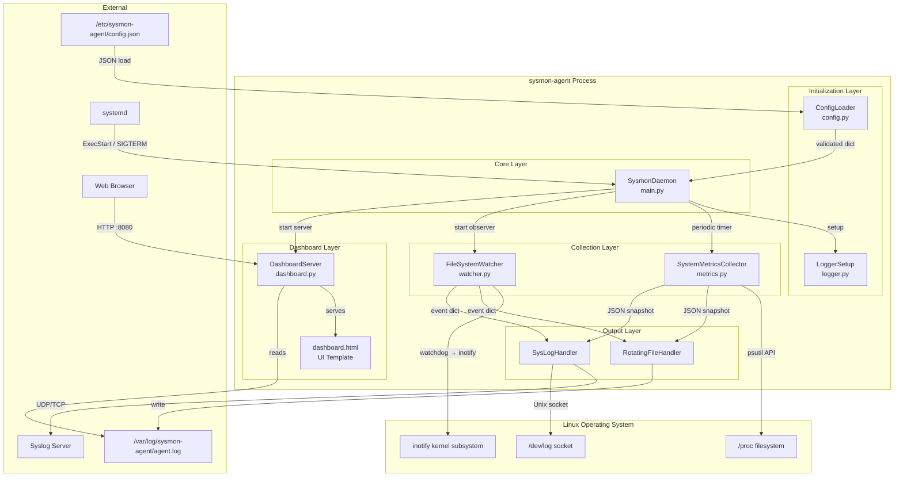
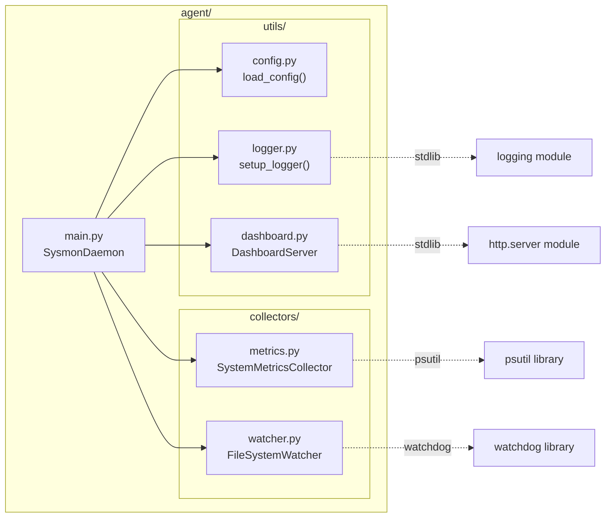
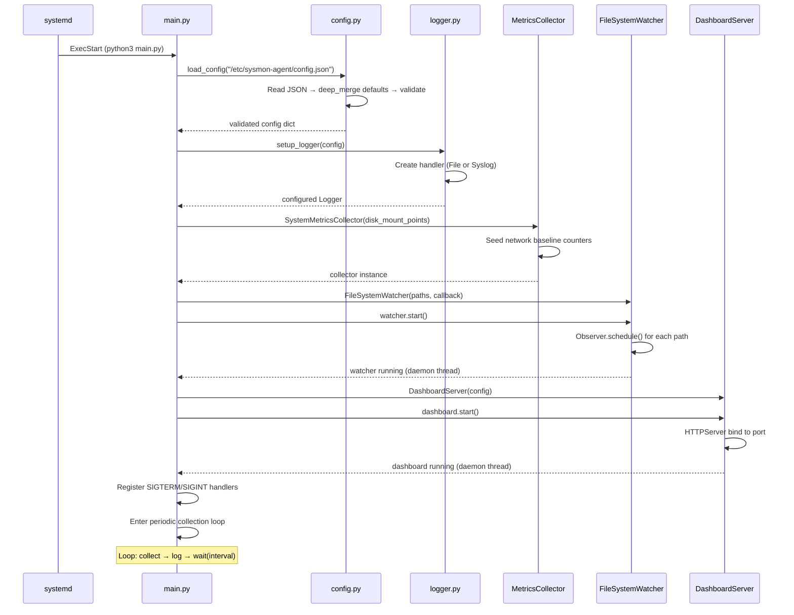
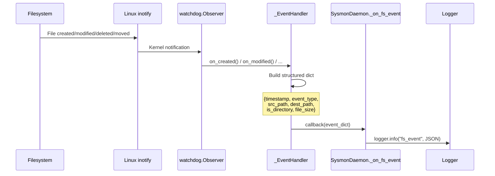
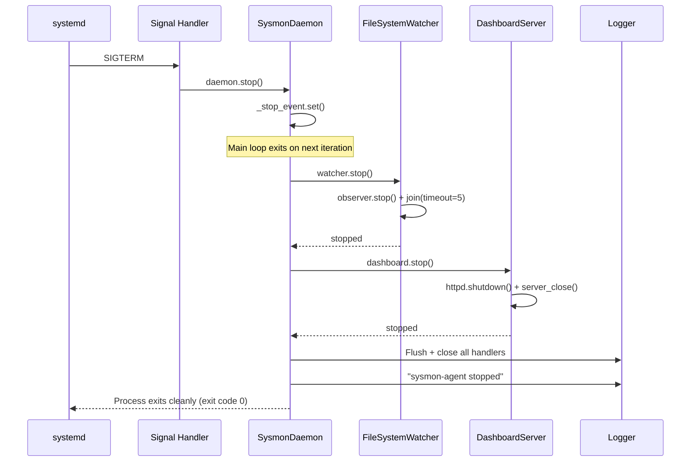
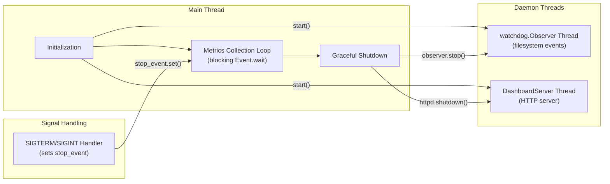
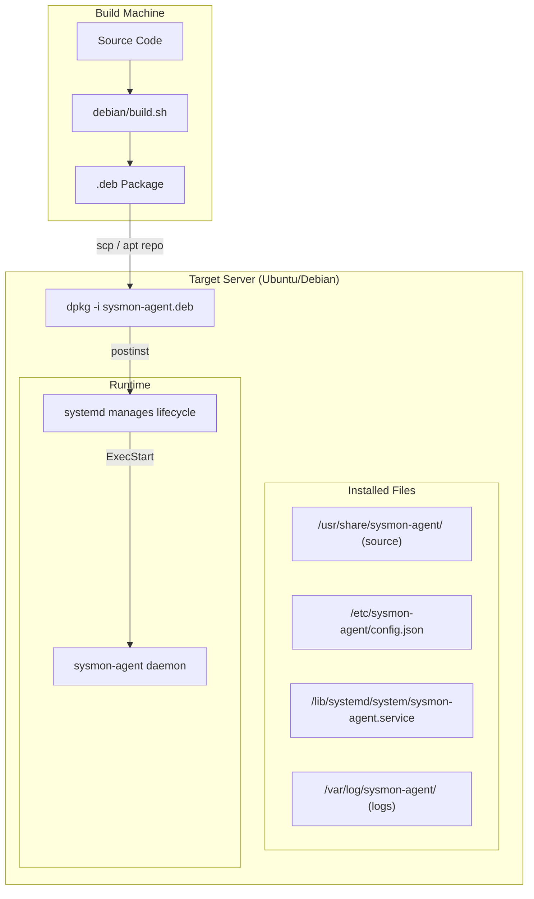

# System Design Document — Lightweight System Monitoring Agent

**Version**: 1.0.0  
**Date**: 2026-06-17  
**Author**: SysAdmin Team

---

## 1. Tổng quan hệ thống (System Overview)

### 1.1 Mục tiêu

Xây dựng một lightweight daemon chạy trên Linux (Ubuntu/Debian) có khả năng:
- Thu thập metrics hệ thống theo chu kỳ cấu hình được
- Giám sát real-time các thay đổi trên filesystem
- Ghi log cấu trúc JSON ra file (có rotation) hoặc gửi Syslog (local/remote)
- Chạy ổn định dưới dạng systemd service, tự khởi động lại khi crash

### 1.2 Phạm vi

| Trong phạm vi | Ngoài phạm vi |
|---|---|
| CPU, RAM, Disk, Network metrics | Alerting/notification system |
| Filesystem event monitoring (watchdog) | Database storage |
| Local file log + Syslog routing | Multi-platform (chỉ Linux) |
| `.deb` packaging | Agent-to-agent communication |
| systemd service management | |
| Web dashboard (HTTP, real-time) | |

---

## 2. Kiến trúc hệ thống (System Architecture)

### 2.1 Architecture Diagram



### 2.2 Component Diagram



---

## 3. Luồng hoạt động chi tiết (Data Flow)

### 3.1 Startup Sequence



### 3.2 Metrics Collection Cycle

```mermaid
sequenceDiagram
    participant loop as Main Loop
    participant col as MetricsCollector
    participant cpu as psutil.cpu_percent
    participant mem as psutil.virtual_memory
    participant dsk as psutil.disk_usage
    participant net as psutil.net_io_counters
    participant log as Logger

    loop->>col: collect_all()

    col->>cpu: cpu_percent(interval=1)
    cpu-->>col: 12.5%

    col->>mem: virtual_memory()
    mem-->>col: total, available, used, percent

    col->>dsk: disk_usage("/")
    dsk-->>col: total, used, free, percent

    col->>net: net_io_counters()
    net-->>col: bytes_sent, bytes_recv, packets...
    col->>col: Calculate delta = current - previous
    col->>col: Calculate throughput = delta / elapsed_seconds
    col->>col: Update baseline (prev = current)

    col-->>loop: {"timestamp", "cpu", "memory", "disk", "network"}
    loop->>log: logger.info("metrics_snapshot", JSON)

    Note over loop: wait(interval seconds) → repeat
```

### 3.3 Filesystem Event Flow



### 3.4 Graceful Shutdown Flow



---

## 4. Cấu trúc dữ liệu (Data Structures)

### 4.1 Metrics Snapshot Schema

```json
{
    "timestamp": "ISO 8601 UTC string",
    "cpu": {
        "cpu_percent": "float — overall CPU usage %",
        "cpu_count_logical": "int — logical core count",
        "cpu_count_physical": "int — physical core count"
    },
    "memory": {
        "total_bytes": "int — total RAM in bytes",
        "available_bytes": "int — available RAM in bytes",
        "used_bytes": "int — used RAM in bytes",
        "used_percent": "float — RAM usage %"
    },
    "disk": {
        "<mount_point>": {
            "total_bytes": "int — total disk space",
            "used_bytes": "int — used disk space",
            "free_bytes": "int — free disk space",
            "used_percent": "float — disk usage %"
        }
    },
    "network": {
        "cumulative": {
            "bytes_sent": "int — total bytes sent since boot",
            "bytes_recv": "int — total bytes received since boot",
            "packets_sent": "int",
            "packets_recv": "int",
            "errin": "int — incoming errors",
            "errout": "int — outgoing errors",
            "dropin": "int — incoming drops",
            "dropout": "int — outgoing drops"
        },
        "delta": {
            "bytes_sent": "int — bytes sent since last collection",
            "bytes_recv": "int — bytes received since last collection",
            "bytes_sent_per_sec": "float — send throughput (B/s)",
            "bytes_recv_per_sec": "float — receive throughput (B/s)",
            "elapsed_seconds": "float — time since last collection"
        }
    }
}
```

### 4.2 Filesystem Event Schema

```json
{
    "timestamp": "ISO 8601 UTC string",
    "event_type": "created | modified | deleted | moved",
    "src_path": "string — original file path",
    "dest_path": "string | null — destination path (only for moved events)",
    "is_directory": "boolean",
    "file_size": "int | null — file size in bytes (null if deleted or inaccessible)"
}
```

### 4.3 Configuration Schema

```json
{
    "interval": "int (required) — seconds between collection cycles, must be > 0",
    "disk_mount_points": "list[str] (optional, default: [\"/\"]) — mount points to monitor",
    "monitored_paths": "list[str] (optional, default: []) — paths for filesystem watcher",
    "logging": {
        "mode": "str (required) — 'file' or 'syslog'",
        "log_file_path": "str — required when mode='file'",
        "max_bytes": "int (default: 10MB) — max file size before rotation",
        "backup_count": "int (default: 5) — number of rotated backups",
        "syslog_address": "str (default: '127.0.0.1') — syslog host or '/dev/log'",
        "syslog_port": "int (default: 514) — syslog port (1-65535)",
        "syslog_protocol": "str (default: 'udp') — 'udp' or 'tcp'"
    },
    "dashboard": {
        "enabled": "bool (default: true) — enable/disable the web dashboard",
        "port": "int (default: 8080) — HTTP port for dashboard server (1-65535)",
        "bind_address": "str (default: '0.0.0.0') — bind address for dashboard"
    }
}
```

---

## 5. Design Decisions & Trade-offs

### 5.1 Tại sao chọn `psutil` thay vì parse `/proc` trực tiếp?

| Tiêu chí | psutil | /proc parsing |
|---|---|---|
| Portability | ✅ Cross-platform API | ❌ Linux-only |
| Maintainability | ✅ Stable API, well-tested | ⚠️ Kernel format có thể thay đổi |
| Performance | ⚠️ Nhẹ hơn một chút overhead | ✅ Zero overhead |
| Development speed | ✅ Nhanh, ít bug | ❌ Phải parse text format |

**Quyết định**: Chọn `psutil` vì reliability và maintainability quan trọng hơn micro-optimization cho một agent chạy mỗi 30 giây.

### 5.2 Tại sao chọn `watchdog` thay vì `inotify` thuần?

| Tiêu chí | watchdog | pyinotify / raw inotify |
|---|---|---|
| API level | ✅ High-level, event classes | ❌ Low-level, manual mask handling |
| Recursive watch | ✅ Built-in | ⚠️ Manual implementation |
| Error handling | ✅ Graceful path skip | ❌ Manual |
| Dependency | ⚠️ External package | ✅ Kernel-native |

**Quyết định**: Chọn `watchdog` vì API tốt hơn và hỗ trợ recursive watching tự động. Internally nó vẫn dùng `inotify` trên Linux.

### 5.3 Tại sao `threading.Event.wait()` thay vì `time.sleep()`?

```python
# ❌ time.sleep — không responsive
while running:
    collect_metrics()
    time.sleep(30)  # Phải đợi hết 30s mới thoát được

# ✅ Event.wait — responsive
while not stop_event.is_set():
    collect_metrics()
    stop_event.wait(timeout=30)  # Thoát ngay khi nhận signal
```

**Lý do**: `Event.wait()` cho phép daemon phản hồi ngay lập tức khi nhận `SIGTERM`, thay vì phải đợi hết interval.

### 5.4 Root vs Non-root User

| Chạy bằng | Ưu điểm | Nhược điểm |
|---|---|---|
| **root** | ✅ Đọc được mọi file, monitor `/etc`, `/var` | ❌ Rủi ro bảo mật cao |
| **sysmon user** | ✅ Blast radius nhỏ, principle of least privilege | ❌ Không đọc được file restricted |

**Quyết định**: Mặc định chạy root (cần cho broad monitoring), nhưng cung cấp option trong service file để chuyển sang user `sysmon` khi chỉ cần monitor user-owned paths. Kết hợp thêm systemd hardening (`NoNewPrivileges`, `ProtectSystem=strict`).

### 5.5 File Logging vs Syslog

| Mode | Khi nào dùng | Ưu điểm | Nhược điểm |
|---|---|---|---|
| **file** | Standalone server, dev/test | ✅ Đơn giản, grep được | ❌ Không centralized |
| **syslog** | Enterprise, multi-server | ✅ Centralized, compatible | ⚠️ Cần syslog server |

**Quyết định**: Hỗ trợ cả hai, chọn qua `config.json`. File mode có `RotatingFileHandler` để tránh disk exhaustion.

### 5.6 Network Metrics: Delta vs Cumulative

**Quyết định**: Report cả hai vì:
- **Cumulative**: Hữu ích để tính total traffic qua session
- **Delta**: Hữu ích để monitor throughput real-time (bytes/sec)
- Delta được normalize bởi `elapsed_seconds` thực tế (không assume interval chính xác)

---

## 6. Threading Model



- **Main thread**: Chạy periodic metrics loop, block trên `Event.wait()`
- **Observer thread**: Daemon thread chạy watchdog, tự tắt khi main thread kết thúc
- **Dashboard thread**: Daemon thread chạy HTTP server, phục vụ UI và API endpoints
- **Không dùng asyncio**: Đơn giản hơn cho use case này, tránh complexity không cần thiết

---

## 7. Error Handling Strategy

| Layer | Strategy | Example |
|---|---|---|
| **Config loading** | Fail fast — raise ngay | `FileNotFoundError`, `ValueError` |
| **Metrics collection** | Fail soft — return `None` per metric | `psutil.Error` → log error, return `None` |
| **Filesystem watcher** | Skip bad paths, keep running | `OSError` → log warning, skip path |
| **Dashboard server** | Fail soft — log and continue | `OSError` → log error, agent runs without dashboard |
| **Logger setup** | Fail fast — log là critical | `OSError` → crash (cannot operate without logs) |
| **Main loop** | Catch-all + shutdown | `Exception` → log, then `_shutdown()` |
| **Signal handling** | Set event, never raise | `SIGTERM` → `stop_event.set()` |

---

## 8. Deployment Architecture



---

## 9. Security Considerations

1. **systemd hardening**: `NoNewPrivileges=true`, `ProtectSystem=strict`, `ProtectHome=read-only`, `PrivateTmp=true`
2. **Config as conffile**: `dpkg` sẽ không overwrite user edits khi upgrade
3. **Log rotation**: Tránh disk exhaustion từ log files
4. **Read-only access**: Agent chỉ **đọc** system info, không **ghi** (ngoài log files)
5. **Graceful error handling**: Không crash toàn bộ khi 1 metric fail
6. **Minimal dependencies**: Chỉ 2 external packages (`psutil`, `watchdog`)

---

## 10. Các hạn chế đã biết (Known Limitations)

1. **Single-node only**: Không có centralized collector/dashboard
2. **No alerting**: Không gửi alert khi metrics vượt threshold
3. **CPU measurement blocking**: `cpu_percent(interval=1)` block 1 giây mỗi cycle
4. **No config hot-reload**: Cần restart service sau khi sửa config
5. **watchdog overhead**: Recursive watching trên large directory trees có thể tốn inotify watches
